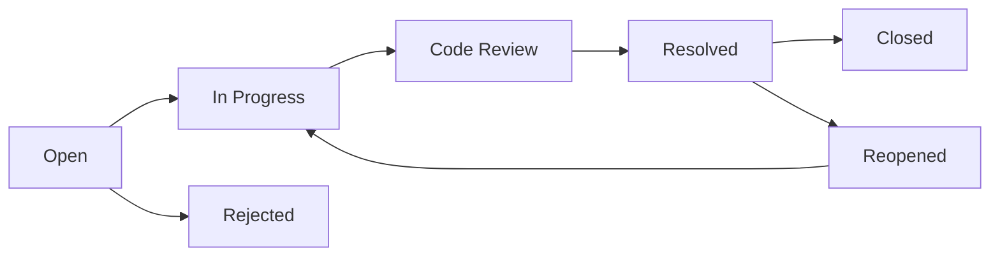
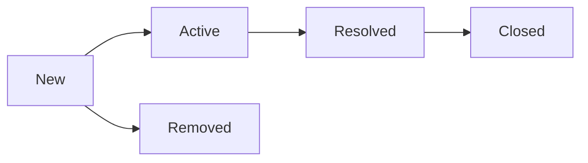
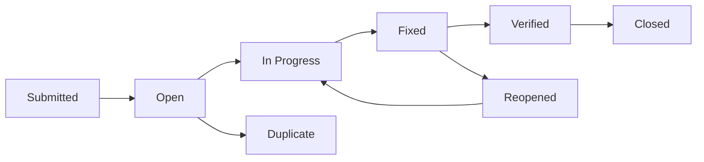

# 🪲 Bug Lifecycle Diagrams

This mindmap illustrates bug lifecycle workflows in popular issue tracking systems. It helps QA engineers understand typical status transitions across platforms.

---

## 🛠️ Jira Workflow

**Description:**  
[Jira by Atlassian](https://www.atlassian.com/software/jira) offers customizable workflows. A common bug flow includes development, review, resolution, and closure. Bugs may be reopened after unsuccessful verification. `Rejected` is used for invalid or duplicate issues.

---

## 🔧 Azure DevOps Workflow

**Description:**  
[Azure DevOps by Microsoft](https://azure.microsoft.com/en-us/products/devops/) applies a linear flow often used in SCRUM teams. `Active` indicates work in progress, and `Removed` is for issues that won’t be pursued further.

---

## 💡 YouTrack Workflow

**Description:**  
[YouTrack by JetBrains](https://www.jetbrains.com/youtrack/) provides flexible transitions. `Submitted` marks the initial report, while `Verified` confirms successful retesting. `Duplicate` flags repeated issues.

---
