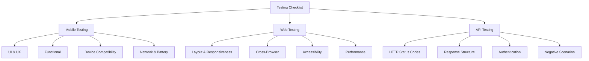

# ✅ Checklist for Mobile, Web, and API Testing

This mindmap outlines key checkpoints for manual QA engineers across different test targets: mobile apps, web platforms, and APIs. Use it as a structured reference during smoke, regression, and exploratory testing.

---

## 🌐 Technique Overview

---

## 📱 Mobile Testing

- **UI & UX**  
  Layout consistency, touch targets, scroll behavior, animations.

- **Functional**  
  Core flows (login, checkout), navigation, back button support.

- **Compatibility**  
  Test on different devices, OS versions, screen sizes.

- **Network & Battery**  
  Offline mode, low connectivity, battery drain impact.

---

## 🖥️ Web Testing

- **Layout & Responsiveness**  
  Grid alignment, media queries, resizing behavior.

- **Cross-Browser**  
  Test in Chrome, Firefox, Safari, Edge (including mobile versions).

- **Accessibility**  
  Contrast ratio, ARIA labels, screen reader compatibility.

- **Performance**  
  Load time, resource usage, page weight.

---

## 🔌 API Testing

- **HTTP Status Codes**  
  Validate 2xx, 4xx, 5xx responses.

- **Response Structure**  
  JSON/XML format, data types, required fields.

- **Authentication**  
  Token validity, expired credentials, role-based access.

- **Negative Scenarios**  
  Malformed requests, unauthorized access, throttling limits.

---

