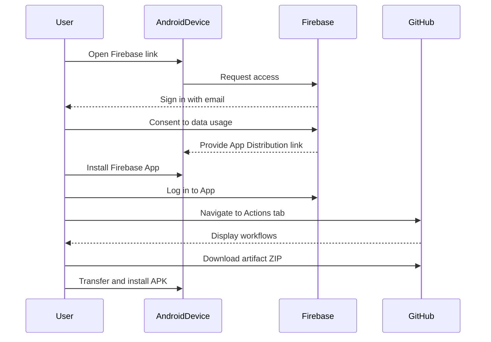
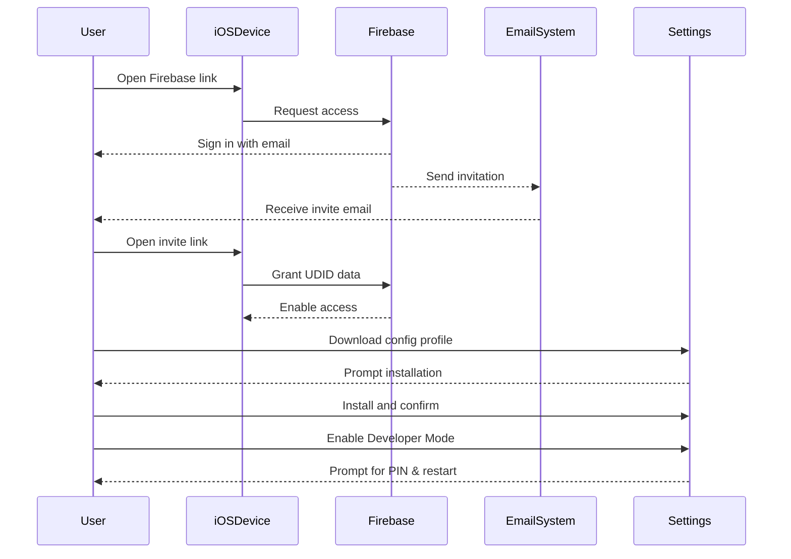

```mermaid
flowchart RL
    A[User opens Firebase link] --> B[Device requests access]
    B --> C[Sign in via email]
    C --> D[Consent to data usage]
    D --> E[App Distribution link provided]
    E --> F[User installs APK via Firebase App]
    F --> G[Log in to the app]
    G --> H[Access GitHub Actions]
    H --> I[Download artifact ZIP]
    I --> J[Transfer APK to Android device]
    J --> K[Install manually]

```

```mermaid
flowchart RL
    A[User opens Firebase link] --> B[Device requests access]
    B --> C[Sign in via email]
    C --> D[Firebase sends email invite]
    D --> E[User receives invite]
    E --> F[Open link and share UDID]
    F --> G[Firebase grants access]
    G --> H[Download config profile]
    H --> I[Install profile via Settings]
    I --> J[Enable Developer Mode]
    J --> K[Enter PIN and restart device]
```

# 📋 Firebase-based App Distribution Flow

This document outlines the process for distributing and installing a mobile application (for both Android and iOS platforms) using Firebase App Distribution. All company-specific identifiers and links have been **anonymized**.

## 🔐 Anonymized Elements

- App and company names replaced with `App`, `AnonCorp`
- Email domains changed to `anon@team.example.com`
- Firebase links like substituted with `firebase.dev/i/abcdef123456`
- GitHub repository generalized to `GitHub Actions`
- Specific IDs replaced with dummy hashes (`abcdef123456`, `xyz890112233`)

---

## 📑 Table of Contents

- [🔐 Anonymized Elements](#-anonymized-elements)
- [⚙️ Key Process Components](#-key-process-components)
   - [🔹 Firebase Distribution](#-firebase-distribution)
   - [🤖 Android Setup](#-android-setup)
     - [📦 App Launch via GitHub Actions (Android only)](#-app-launch-via-github-actions-android-only)
   - [🍏 iOS Setup](#-ios-setup)
     - [📜 Configuration Profile Installation (iOS)](#-configuration-profile-installation-ios)
     - [🧪 Enable Developer Mode (iOS)](#-enable-developer-mode-ios)
- [📱 Android Installation](#-android-installation)
   - [🗺️ Flowchart](#️-flowchart)
   - [⏳ Sequence](#-sequence)
- [🍏 iOS Installation](#-ios-installation)
   - [🗺️ Flowchart](#️-flowchart-1)
   - [⏳ Sequence](#-sequence-1)

---

## ⚙️ Key Process Components

### 🔹 Firebase Distribution

- Firebase serves as the primary distribution platform for internal testing.
- Testers use generated invitation links to access builds.

### 🤖 Android Setup

1. Open the Firebase link on an Android device.
2. Sign in using an internal email address.
3. Consent to data collection.
4. Install the Firebase App Distribution app.
5. Log in to the app.

#### 📦 App Launch via GitHub Actions (Android only)

1. Go to the `Actions` tab in the GitHub repository.
2. Select a workflow run.
3. Download the resulting artifact `.zip`.
4. Unzip and install the `.APK` either manually or via ADB.

```bash
adb install -r -i com.android.vending app-release.apk
```


### 🍏 iOS Setup

1. Open the Firebase link on an iOS device.
2. Sign in with an internal email.
3. Wait for the invitation email.
4. Open the link from the invitation email.
5. Log in and agree to share UDID/device data.

#### 📜 Configuration Profile Installation (iOS)

1. Download the configuration profile.
2. Navigate to device settings.
3. Install and confirm the profile installation.

#### 🧪 Enable Developer Mode (iOS)

1. Go to Device Settings → Privacy & Security.
2. Enable Developer Mode.
3. Enter the PIN and restart the device.


--- 
## 🤖 Android Installation 
### 🗺️ Flowchart



### ⏳ Sequence



---

## 🍏 iOS Installation 
### 🗺️ Flowchart



### ⏳ Sequence


