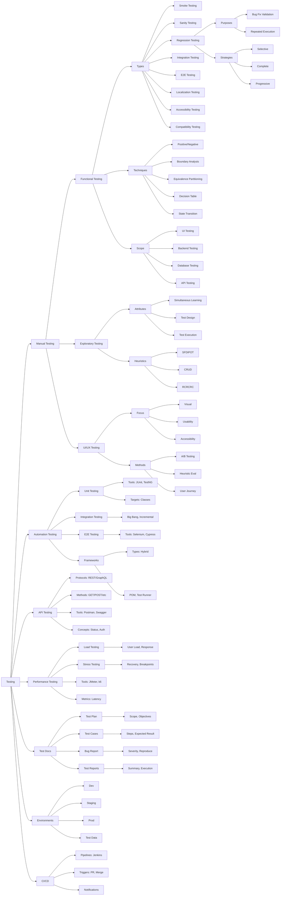

# QA Testing Structure – Mermaid Diagrams Overview

This page presents three visual formats of the QA testing structure using Mermaid diagrams. Each format helps illustrate core testing domains including manual testing, automation, API testing, performance testing, documentation, environments, and CI/CD practices.

The diagrams are organized to support different use cases: strategy planning, learning, documentation, or team onboarding. Choose the format that works best for your context.

---

## 🧠 Mindmap

A beautiful and tree-like representation of the full QA structure. Great for visual brainstorming and outlining relationships.

**Note:** Visually appealing but harder to read at a glance when the structure grows.

```mermaid
mindmap
  root((Testing))

    Manual Testing
      Functional Testing
        Types
          Smoke Testing
            Scope
              Critical Functionality
              Build Verification
            Automation
              CI/CD Triggers
          Sanity Testing
            Purpose
              Minor Changes Validation
              Quick Health Check
          Regression Testing
            Purposes
              Bug Fix Validation
              Repeated Test Execution
            Strategies
              Selective Regression
              Complete Regression
              Progressive Regression
          Integration Testing
            Strategies
              Big Bang
              Incremental
          End-to-End Testing
            Coverage
              Full Workflow
              Cross-system Scenarios
          Localization Testing
            Scope
              Language Accuracy
              Cultural Relevance
          Accessibility Testing
            Guidelines
              WCAG
              ARIA Roles
          Compatibility Testing
            Targets
              Browser
              Device
              OS
        Techniques
          Positive Testing
          Negative Testing
          Boundary Value Analysis
          Equivalence Partitioning
          Decision Table Testing
          State Transition Testing
        Scope
          UI Testing
          Backend Testing
          Database Testing
          API Testing
      Exploratory Testing
        Attributes
          Simultaneous Learning
          Test Design
          Test Execution
        Heuristics
          SFDIPOT
          CRUD
          RCRCRC
      UI/UX Testing
        Areas
          Visual Consistency
          Usability
          Accessibility
        Methods
          A/B Testing
          Heuristic Evaluation
          User Journey Analysis

    Automation Testing
      Unit Testing
        Targets
          Functions
          Methods
        Tools
          JUnit
          NUnit
          TestNG
      Integration Testing
        Approaches
          Top-down
          Bottom-up
        Tools
          Pytest
          Mocha
      End-to-End Testing
        Coverage
          Full User Scenario
        Tools
          Selenium
          Cypress
          Playwright
      Frameworks
        Types
          Data-Driven
          Keyword-Driven
          Hybrid
        Concepts
          Page Object Model
          Test Runner

    API Testing
      Protocols
        REST
        GraphQL
      Methods
        GET
        POST
        PUT
        DELETE
      Tools
        Postman
        Insomnia
        Swagger
      Concepts
        Status Codes
        Authorization
        Headers
        JSON Structure
        Response Time
        Assertions

    Performance Testing
      Load Testing
        Goals
          Concurrent Users
          Response Times
      Stress Testing
        Objectives
          Breakpoint Detection
          Recovery Check
      Tools
        JMeter
        Locust
        Apptim
        k6
      Metrics
        Throughput
        Latency
        Error Rate

    Test Documentation
      Test Plan
        Contents
          Scope
          Objectives
          Schedule
      Test Cases
        Components
          Preconditions
          Test Steps
          Expected Results
      Checklists
        Types
          UI Checklist
          Regression Checklist
      Bug Report
        Elements
          Summary
          Steps to Reproduce
          Severity
          Priority
      Test Reports
        Types
          Test Summary Report
          Defect Report
          Test Execution Report
          Performance Test Report
          Security Test Report
          Regression Test Report

    Environments
      Dev
        Characteristics
          Latest Code
          Debugging Enabled
      QA/Staging
        Purpose
          Stability Testing
          Pre-release Validation
      Production
        Focus
          Real Data
          Monitoring
      Test Data
        Sources
          Mocked Data
          Sanitized Real Data
        Management
          Static
          Dynamic

    CI/CD
      Pipeline Integration
        Platforms
          GitHub Actions
          GitLab CI
          Jenkins
      Test Automation Triggers
        Events
          Pull Request
          Merge
          Release
        Notifications
          Slack
          Email
```

---

## 📐 Vertical Flowchart

A top-down flowchart that follows Mermaid’s recommended rendering structure for clear nesting. Ideal for technical documentation and Confluence integration.

**Note:** Mermaid documentation suggests this layout renders more reliably across platforms.

```mermaid
flowchart TD
    A[Testing]

    A --> B[Manual Testing]
    A --> C[Automation Testing]
    A --> D[API Testing]
    A --> E[Performance Testing]
    A --> F[Test Documentation]
    A --> G[Environments]
    A --> H[CI/CD Integration]

    %% Manual Testing
    B --> B1[Functional Testing]
    B1 --> B1a[Types]
    B1a --> B1a1[Smoke Testing]
    B1a1 --> B1a1a[Scope: Critical Functionality & Build Verification]
    B1a1 --> B1a1b[Automation: CI/CD Triggers]
    B1a --> B1a2[Sanity Testing]
    B1a2 --> B1a2a[Purpose: Quick Health Check]
    B1a --> B1a3[Regression Testing]
    B1a3 --> B1a3a[Purposes]
    B1a3a --> B1a3a1[Bug Fix Validation]
    B1a3a --> B1a3a2[Repeated Execution]
    B1a3 --> B1a3b[Strategies]
    B1a3b --> B1a3b1[Selective]
    B1a3b --> B1a3b2[Complete]
    B1a3b --> B1a3b3[Progressive]
    B1a --> B1a4[Integration Testing]
    B1a --> B1a5[E2E Testing]
    B1a --> B1a6[Localization Testing]
    B1a --> B1a7[Accessibility Testing]
    B1a --> B1a8[Compatibility Testing]

    B1 --> B1b[Techniques]
    B1b --> B1b1[Positive/Negative Testing]
    B1b --> B1b2[Boundary Value Analysis]
    B1b --> B1b3[Equivalence Partitioning]
    B1b --> B1b4[Decision Table Testing]
    B1b --> B1b5[State Transition Testing]

    B1 --> B1c[Scope]
    B1c --> B1c1[UI Testing]
    B1c --> B1c2[Backend Testing]
    B1c --> B1c3[Database Testing]
    B1c --> B1c4[API Testing]

    B --> B2[Exploratory Testing]
    B2 --> B2a[Attributes]
    B2a --> B2a1[Simultaneous Learning]
    B2a --> B2a2[Test Design]
    B2a --> B2a3[Test Execution]
    B2 --> B2b[Heuristics]
    B2b --> B2b1[SFDIPOT]
    B2b --> B2b2[CRUD]
    B2b --> B2b3[RCRCRC]

    B --> B3[UI/UX Testing]
    B3 --> B3a[Focus Areas]
    B3a --> B3a1[Visual Consistency]
    B3a --> B3a2[Usability]
    B3a --> B3a3[Accessibility]
    B3 --> B3b[Methods]
    B3b --> B3b1[A/B Testing]
    B3b --> B3b2[Heuristic Evaluation]
    B3b --> B3b3[User Journey Review]

    %% Automation Testing
    C --> C1[Unit Testing]
    C1 --> C1a[Tools: JUnit, TestNG]
    C1 --> C1b[Targets: Methods & Classes]

    C --> C2[Integration Testing]
    C2 --> C2a[Big Bang / Incremental]

    C --> C3[E2E Testing]
    C3 --> C3a[Tools: Selenium, Cypress, Playwright]

    C --> C4[Frameworks]
    C4 --> C4a[Types: Keyword, Data-Driven, Hybrid]
    C4 --> C4b[POM, Test Runner]

    %% API Testing
    D --> D1[Protocols: REST / GraphQL]
    D --> D2[Methods: GET, POST, PUT, DELETE]
    D --> D3[Tools: Postman, Insomnia, Swagger]
    D --> D4[Concepts: Status Codes, Auth, Headers, JSON]

    %% Performance Testing
    E --> E1[Load Testing]
    E1 --> E1a[User Load, Response Time]

    E --> E2[Stress Testing]
    E2 --> E2a[Recovery, Breakpoint]

    E --> E3[Tools: JMeter, Locust, k6]
    E --> E4[Metrics: Latency, Throughput, Error Rate]

    %% Test Docs
    F --> F1[Test Plan]
    F1 --> F1a[Scope, Objectives, Schedule]
    F --> F2[Test Cases]
    F2 --> F2a[Steps, Preconditions, Expected Result]
    F --> F3[Checklists]
    F --> F4[Bug Reports]
    F4 --> F4a[Steps to Reproduce, Severity, Priority]
    F --> F5[Test Reports]
    F5 --> F5a[Summary, Execution, Defect, Performance, Regression]

    %% Environments
    G --> G1[Dev]
    G1 --> G1a[Latest Code, Debugging]
    G --> G2[QA/Staging]
    G2 --> G2a[Stable Build, Pre-prod Validation]
    G --> G3[Production]
    G3 --> G3a[Live Data, Monitoring]
    G --> G4[Test Data]
    G4 --> G4a[Mocked / Masked]
    G4 --> G4b[Static / Dynamic]

    %% CI/CD
    H --> H1[Pipelines: Jenkins, GitHub Actions]
    H --> H2[Triggers: PR, Merge, Release]
    H --> H3[Notifications: Slack, Email]
```

---

## 📊 Horizontal Flowchart

A left-to-right layout designed for better readability, especially in wide screens, presentations or markdown-based docs.

**Note:** Easier to consume quickly and suits narrative-style walkthroughs.

