# 📱 Mobile Application Testing Lifecycle

## 📝 Overview

This flowchart presents a comprehensive breakdown of the mobile app testing lifecycle, covering functional and non-functional aspects across iOS and Android platforms. The structure reflects real-world QA processes — from requirement analysis to interruption resilience.

It is designed for QA engineers, test leads, and mobile teams seeking a visual roadmap for testing strategy, execution, and automation integration.

---

**Scope Includes:**  
- Functional, performance, security, usability, and API testing  
- Platform-specific considerations (iOS / Android)  
- Hardware integrations (Bluetooth, NFC, sensors)  
- Biometric auth, lifecycle events (install/upgrade/uninstall), and OS-level interruptions  
- CI/CD tool integration and reporting phase

**Recommended For:**  
Mobile QA teams, onboarding sessions, documentation wikis, internal audits

**Format:**  
Mermaid Flowchart (GitHub-ready and easy to customize)

---

## 📐 Vertical Flowchart

A top-down flowchart that follows Mermaid’s recommended rendering structure for clear nesting. Ideal for technical documentation and Confluence integration.

**Note:** Mermaid documentation suggests this layout renders more reliably across platforms.

```mermaid
graph TD
  A[Requirements Analysis]
    A --> A1[Business Requirements]
    A --> A2[Technical Requirements]
    A --> A3[Regulatory & Compliance]
 
  A --> B[Test Planning]
    B --> B1[Scope Definition]
    B --> B2[Platform Strategy]
      B2 --> B2a[iOS Specifics]
        B2a --> B2a1[Device Coverage]
        B2a --> B2a2[App Store Guidelines]
      B2 --> B2b[Android Specifics]
        B2b --> B2b1[Fragmentation Strategy]
        B2b --> B2b2[Google Play Policies]
    B --> B3[Tool Selection]
      B3 --> B3a[Appium]
      B3 --> B3b[Detox]
      B3 --> B3c[Espresso]
      B3 --> B3d[XCTest]

  B --> C[Test Design]
    C --> C1[Test Scenarios]
    C --> C2[Test Cases]
      C2 --> C2a[Positive]
      C2 --> C2b[Negative]
      C2 --> C2c[Edge Cases]
    C --> C3[Mapping to Requirements]

  C --> D[Test Environment Setup]
    D --> D1[Devices]
      D1 --> D1a[iOS Real Devices]
      D1 --> D1b[iOS Simulator]
      D1 --> D1c[Android Real Devices]
      D1 --> D1d[Android Emulator]
    D --> D2[Cloud Farms]
      D2 --> D2a[BrowserStack]
      D2 --> D2b[Firebase Test Lab]
    D --> D3[CI/CD Integration]
      D3 --> D3a[GitHub Actions]
      D3 --> D3b[Bitrise]
      D3 --> D3c[Jenkins]

  D --> E[Test Execution]
    E --> E1[Functional Testing]
      E1 --> E1a[UI/UX Testing]
        E1a --> E1a1[Button Behavior]
        E1a --> E1a2[Gesture Accuracy]
      E1 --> E1b[Input Validation]
        E1b --> E1b1[Field Constraints]
        E1b --> E1b2[Boundary Testing]
      E1 --> E1c[Navigation Testing]
        E1c --> E1c1[Screen Flow]
        E1c --> E1c2[Deep Linking]
      E1 --> E1d[Localization Testing]
        E1d --> E1d1[Date/Time Formats]
        E1d --> E1d2[RTL Layouts]
      E1 --> E1e[Platform-Specific Checks]
        E1e --> E1e1[iOS: Push Permissions]
        E1e --> E1e2[Android: Background Services]

    E --> E2[Non-Functional Testing]
      E2 --> E2a[Performance]
        E2a --> E2a1[Launch Time]
        E2a --> E2a2[Frame Drops]
        E2a --> E2a3[Battery Usage]
      E2 --> E2b[Network Throttling]
        E2b --> E2b1[2G]
        E2b --> E2b2[3G]
        E2b --> E2b3[4G]
        E2b --> E2b4[LTE]
        E2b --> E2b5[5G]
        E2b --> E2b6[Wi-Fi]
        E2b --> E2b7[No Network]
      E2 --> E2c[Usability]
        E2c --> E2c1[VoiceOver]
        E2c --> E2c2[TalkBack]
        E2c --> E2c3[Font Scaling]
        E2c --> E2c4[Theme Support]
      E2 --> E2d[Security]
        E2d --> E2d1[Data Encryption]
        E2d --> E2d2[SSL Pinning]
        E2d --> E2d3[Jailbreak/Root Detection]

    E --> E3[API Testing]
      E3 --> E3a[Authentication]
        E3a --> E3a1[OAuth]
        E3a --> E3a2[Token Expiry]
      E3 --> E3b[Response Validation]
        E3b --> E3b1[Status Codes]
        E3b --> E3b2[Headers]
        E3b --> E3b3[Payload]
      E3 --> E3c[Error Handling]
        E3c --> E3c1[Timeout]
        E3c --> E3c2[Retry Mechanism]
      E3 --> E3d[Rate Limiting]
      E3 --> E3e[Backend Integration]

    E --> E4[Biometric Auth]
      E4 --> E4a[Fingerprint]
      E4 --> E4b[Face ID]
      E4 --> E4c[Fallback to PIN]
      E4 --> E4d[Permission Dialogs]

    E --> E5[Install / Upgrade / Uninstall]
      E5 --> E5a[Installation]
        E5a --> E5a1[First Launch]
        E5a --> E5a2[Permission Prompts]
      E5 --> E5b[Upgrade]
        E5b --> E5b1[Data Migration]
        E5b --> E5b2[Backward Compatibility]
      E5 --> E5c[Uninstall]
        E5c --> E5c1[Data Removal]
        E5c --> E5c2[Cache Cleanup]

    E --> E6[Hardware Interaction]
      E6 --> E6a[Bluetooth]
        E6a --> E6a1[Pairing]
        E6a --> E6a2[Data Transfer]
      E6 --> E6b[NFC]
        E6b --> E6b1[Tap-to-Pay]
        E6b --> E6b2[Card Emulation]
      E6 --> E6c[Camera/Mic]
        E6c --> E6c1[Media Capture]
        E6c --> E6c2[Permissions]
      E6 --> E6d[Sensors]
        E6d --> E6d1[GPS Accuracy]
        E6d --> E6d2[Gyroscope Events]

    E --> E7[Interruption Testing]
      E7 --> E7a[Incoming Calls]
      E7 --> E7b[SMS]
      E7 --> E7c[Push Notifications]
      E7 --> E7d[Backgrounding]
      E7 --> E7e[OS Dialogs]

  E --> F[Defect Reporting]
    F --> F1[Jira]
    F --> F2[Azure DevOps]
    F --> F3[Screenshots]
    F --> F4[Logs]
    F --> F5[Video Playback]

  F --> G[Test Closure]
    G --> G1[Metrics Collection]
      G1 --> G1a[Test Coverage]
      G1 --> G1b[Pass/Fail Ratio]
      G1 --> G1c[Defect Density]
    G --> G2[Final Report]
    G --> G3[Lessons Learned]
```

---

## 📊 Horizontal Flowchart

A left-to-right layout designed for better readability, especially in wide screens, presentations or markdown-based docs.

**Note:** Easier to consume quickly and suits narrative-style walkthroughs.

```mermaid
graph LR
  A[Requirements Analysis]
    A --> A1[Business Requirements]
    A --> A2[Technical Requirements]
    A --> A3[Regulatory & Compliance]

  A --> B[Test Planning]
    B --> B1[Scope Definition]
    B --> B2[Platform Strategy]
      B2 --> B2a[iOS Specifics]
        B2a --> B2a1[Device Coverage]
        B2a --> B2a2[App Store Guidelines]
      B2 --> B2b[Android Specifics]
        B2b --> B2b1[Fragmentation Strategy]
        B2b --> B2b2[Google Play Policies]
    B --> B3[Tool Selection]
      B3 --> B3a[Appium]
      B3 --> B3b[Detox]
      B3 --> B3c[Espresso]
      B3 --> B3d[XCTest]

  B --> C[Test Design]
    C --> C1[Test Scenarios]
    C --> C2[Test Cases]
      C2 --> C2a[Positive]
      C2 --> C2b[Negative]
      C2 --> C2c[Edge Cases]
    C --> C3[Mapping to Requirements]

  C --> D[Test Environment Setup]
    D --> D1[Devices]
      D1 --> D1a[iOS Real Devices]
      D1 --> D1b[iOS Simulator]
      D1 --> D1c[Android Real Devices]
      D1 --> D1d[Android Emulator]
    D --> D2[Cloud Farms]
      D2 --> D2a[BrowserStack]
      D2 --> D2b[Firebase Test Lab]
    D --> D3[CI/CD Integration]
      D3 --> D3a[GitHub Actions]
      D3 --> D3b[Bitrise]
      D3 --> D3c[Jenkins]

  D --> E[Test Execution]
    E --> E1[Functional Testing]
      E1 --> E1a[UI/UX Testing]
        E1a --> E1a1[Button Behavior]
        E1a --> E1a2[Gesture Accuracy]
      E1 --> E1b[Input Validation]
        E1b --> E1b1[Field Constraints]
        E1b --> E1b2[Boundary Testing]
      E1 --> E1c[Navigation Testing]
        E1c --> E1c1[Screen Flow]
        E1c --> E1c2[Deep Linking]
      E1 --> E1d[Localization Testing]
        E1d --> E1d1[Date/Time Formats]
        E1d --> E1d2[RTL Layouts]
      E1 --> E1e[Platform-Specific Checks]
        E1e --> E1e1[iOS: Push Permissions]
        E1e --> E1e2[Android: Background Services]

    E --> E2[Non-Functional Testing]
      E2 --> E2a[Performance]
        E2a --> E2a1[Launch Time]
        E2a --> E2a2[Frame Drops]
        E2a --> E2a3[Battery Usage]
      E2 --> E2b[Network Throttling]
        E2b --> E2b1[2G]
        E2b --> E2b2[3G]
        E2b --> E2b3[4G]
        E2b --> E2b4[LTE]
        E2b --> E2b5[5G]
        E2b --> E2b6[Wi-Fi]
        E2b --> E2b7[No Network]
      E2 --> E2c[Usability]
        E2c --> E2c1[VoiceOver]
        E2c --> E2c2[TalkBack]
        E2c --> E2c3[Font Scaling]
        E2c --> E2c4[Theme Support]
      E2 --> E2d[Security]
        E2d --> E2d1[Data Encryption]
        E2d --> E2d2[SSL Pinning]
        E2d --> E2d3[Jailbreak/Root Detection]

    E --> E3[API Testing]
      E3 --> E3a[Authentication]
        E3a --> E3a1[OAuth]
        E3a --> E3a2[Token Expiry]
      E3 --> E3b[Response Validation]
        E3b --> E3b1[Status Codes]
        E3b --> E3b2[Headers]
        E3b --> E3b3[Payload]
      E3 --> E3c[Error Handling]
        E3c --> E3c1[Timeout]
        E3c --> E3c2[Retry Mechanism]
      E3 --> E3d[Rate Limiting]
      E3 --> E3e[Backend Integration]

    E --> E4[Biometric Auth]
      E4 --> E4a[Fingerprint]
      E4 --> E4b[Face ID]
      E4 --> E4c[Fallback to PIN]
      E4 --> E4d[Permission Dialogs]

    E --> E5[Install / Upgrade / Uninstall]
      E5 --> E5a[Installation]
        E5a --> E5a1[First Launch]
        E5a --> E5a2[Permission Prompts]
      E5 --> E5b[Upgrade]
        E5b --> E5b1[Data Migration]
        E5b --> E5b2[Backward Compatibility]
      E5 --> E5c[Uninstall]
        E5c --> E5c1[Data Removal]
        E5c --> E5c2[Cache Cleanup]

    E --> E6[Hardware Interaction]
      E6 --> E6a[Bluetooth]
        E6a --> E6a1[Pairing]
        E6a --> E6a2[Data Transfer]
      E6 --> E6b[NFC]
        E6b --> E6b1[Tap-to-Pay]
        E6b --> E6b2[Card Emulation]
      E6 --> E6c[Camera/Mic]
        E6c --> E6c1[Media Capture]
        E6c --> E6c2[Permissions]
      E6 --> E6d[Sensors]
        E6d --> E6d1[GPS Accuracy]
        E6d --> E6d2[Gyroscope Events]

    E --> E7[Interruption Testing]
      E7 --> E7a[Incoming Calls]
      E7 --> E7b[SMS]
      E7 --> E7c[Push Notifications]
      E7 --> E7d[Backgrounding]
      E7 --> E7e[OS Dialogs]

  E --> F[Defect Reporting]
    F --> F1[Jira]
    F --> F2[Azure DevOps]
    F --> F3[Screenshots]
    F --> F4[Logs]
    F --> F5[Video Playback]

  F --> G[Test Closure]
    G --> G1[Metrics Collection]
      G1 --> G1a[Test Coverage]
      G1 --> G1b[Pass/Fail Ratio]
      G1 --> G1c[Defect Density]
    G --> G2[Final Report]
    G --> G3[Lessons Learned]
```

