# 🧪 QA Onboarding Cheat Sheet

## 👋 Welcome to QA

You're the final boss between bugs and the user. Your mission: ensure high product quality, usability, and stability before release. Here’s your quick-start guide.

---

## 🗺️ QA Daily Workflow Diagram

```mermaid
flowchart TD
    A[📝 Review Requirements] --> B[✅ Write Test Cases]
    B --> C[🚀 Execute Tests]
    C --> D[🐞 Log Bugs]
    D --> E[🔁 Verify Fixes]
    E --> F[📣 Join Scrum Activities]
    F --> G[🎉 Release Ready!]
```

---

## 🔧 Core Tools

- ✅ Test Management: [TestRail](https://www.testrail.com/), [Zephyr](https://www.getzephyr.com/), [Xray](https://www.getxray.app/)
- 🐞 Bug Tracking: [Jira](https://www.atlassian.com/software/jira), [YouTrack](https://www.jetbrains.com/youtrack/), [Azure DevOps](https://azure.microsoft.com/en-us/products/devops/)
- 🔌 API Testing: [Postman](https://www.postman.com/), [Insomnia](https://insomnia.rest/)
- 🗄️ DB Access: [DBeaver](https://dbeaver.io/), [MySQL Workbench](https://www.mysql.com/products/workbench/)
- 🌐 Web Debugging: [DevTools](https://developer.chrome.com/docs/devtools/), [Charles](https://www.charlesproxy.com/), [Fiddler](https://www.telerik.com/fiddler)

---

## 🧭 Daily Tasks

- Review new features and requirements  
- Create and execute test cases (manual or automated)  
- Log bugs clearly with steps and screenshots  
- Verify fixes in upcoming builds  
- Join standups, demos, and sprint reviews

---

## 🧱 Test Types

| Type         | Purpose                                  |
|--------------|-------------------------------------------|
| Smoke        | Basic feature check (build validation)    |
| Regression   | Ensure old features aren’t broken         |
| Functional   | Feature-specific behavior                 |
| Exploratory  | Freestyle testing without scripts         |
| API          | Validation of backend responses           |
| UI/UX        | Look & feel consistency, accessibility    |

---

## 🔍 Bug Reporting Tips

- **Title**: Concise but informative  
- **Steps to Reproduce**: Clear, ordered  
- **Actual vs Expected**: State both clearly  
- **Screenshots/Logs**: Always attach when possible  
- **Severity/Priority**: Estimate impact to user/product  

---

## 🧠 Mindset

- Think like a user. Break things intentionally.  
- Be curious, detail-oriented, and skeptical.  
- Quality is everyone's job — but you're the guardian.

---

Happy hunting! 🐛💥
