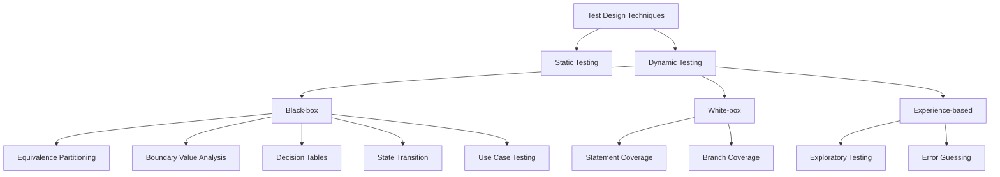

# 🧪 Test Design Techniques

This mindmap presents core test design techniques used in manual QA. These approaches help ensure effective test coverage and detect edge cases early in the development cycle.

---

## 📊 Techniques Overview

---

## 🧩 Technique Descriptions

---

### 🧮 Static Testing  
Reviews and inspections of code, requirements, or design documents without actual execution.  
Common methods include walkthroughs and formal reviews.

---

### ⚙️ Dynamic Testing  
Testing that involves executing code and observing system behavior.

---

### 🔳 Black-box Techniques

- **Equivalence Partitioning**  
  Divides input data into valid and invalid partitions to minimize test cases with maximum coverage.

- **Boundary Value Analysis**  
  Focuses on values at the edge of input ranges, where defects frequently occur.

- **Decision Tables**  
  Uses logical combinations of inputs and outputs in tabular form, ideal for complex business rules.

- **State Transition Testing**  
  Validates system behavior across various states and transitions based on inputs.

- **Use Case Testing**  
  Scenarios based on user interactions, verifying system flows under practical conditions.

---

### 🔲 White-box Techniques

- **Statement Coverage**  
  Ensures each statement in the code is executed at least once.

- **Branch Coverage**  
  Confirms that all decision branches (e.g. `if`, `else`) are tested.

---

### 🧠 Experience-based Techniques

- **Exploratory Testing**  
  Simultaneous learning and test execution without formal test cases.

- **Error Guessing**  
  Relies on tester's experience to predict likely defect-prone areas.

---
