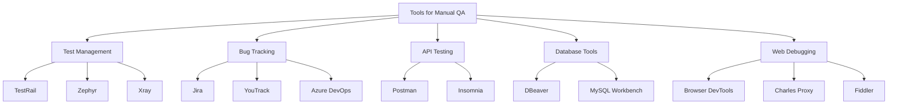

# 🧰 Tools for Manual QA Engineers

This mindmap visualizes essential tools for manual testers across various categories: test case management, bug tracking, backend/database, web debugging, and API testing. Use it to onboard new QA engineers or refresh your toolbox!

---

## 🛠️ Tool Categories

---

## 🔍 Tool Descriptions

### ✅ Test Management

- **[TestRail](https://www.testrail.com/)**  
  Structured platform for test case creation, execution, and reporting. Widely used across QA teams.

- **[Zephyr](https://www.getzephyr.com/)** / **[Xray](https://www.getxray.app/)**  
  Jira-integrated test management systems with traceability and reporting capabilities.

---

### 🐞 Bug Tracking

- **[Jira](https://www.atlassian.com/software/jira)**  
  Most popular issue tracking tool with customizable workflows and integrations.

- **[YouTrack](https://www.jetbrains.com/youtrack/)**  
  Lightweight tool by JetBrains with powerful search, workflows, and agile boards.

- **[Azure DevOps](https://azure.microsoft.com/en-us/products/devops/)**  
  Includes boards and repos. Common in enterprise SCRUM setups.

---

### 🔌 API Testing

- **[Postman](https://www.postman.com/)**  
  REST API testing tool with environment setup, scripting, collections, and automation.

- **[Insomnia](https://insomnia.rest/)**  
  Fast, minimalist API client ideal for quick calls and debugging.

---

### 🗄️ Database Access

- **[DBeaver](https://dbeaver.io/)**  
  Universal SQL client for MySQL, PostgreSQL, SQLite, and more.

- **[MySQL Workbench](https://www.mysql.com/products/workbench/)**  
  Native tool for managing MySQL databases, ideal for schema design and queries.

---

### 🌐 Web Debugging

- **[Browser DevTools](https://developer.chrome.com/docs/devtools/)**  
  Inspect element, network traffic, console logs — built into every browser.

- **[Charles Proxy](https://www.charlesproxy.com/)** / **[Fiddler](https://www.telerik.com/fiddler)**  
  Network traffic sniffers for debugging client-server communication and mobile requests.

---
