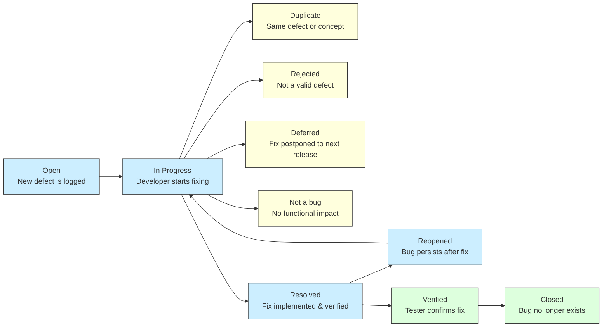

# 🗂️ Jira Workflows

> ⚠️ **Note on References**  
> This document outlines the test approach, scope, environments, risks, stakeholders, and quality criteria used during the MVP phase of the `App` project. All internal references to company names, links, emails, domains, and repositories have been anonymized (e.g. `AnonCorp`, `anon@team.example.com`, `example.atlassian.net`, `github.com/anoncorp/app-repo`).  
> Almost all internal links in this document are provided for illustrative purposes only.  
> They point to this same document and do not represent external sources or separate files.

---

## table of content

## Зміст
- [✅ 1. Jira Tasks for Testing](#-1-jira-tasks-for-testing)
- [🐞 2. Defect Lifecycle (Mermaid Diagram)](#-2-defect-lifecycle-mermaid-diagram)
  - [📋 Defect Status Transitions Table](#-defect-status-transitions-table)
  - [🚦 2.1 Defect Severity Classification](#-21-defect-severity-classification)
  - [🧭 2.2 Defect Fixing Priority Guide](#-22-defect-fixing-priority-guide)
- [🐞 3. Defect Reporting and Management Rules](#-3-defect-reporting-and-management-rules)
  - [3.1 In the Scope of Sprint Feature Testing](#31-in-the-scope-of-sprint-feature-testing)
  - [3.2 Not in the Scope of Sprint Feature Testing](#32-not-in-the-scope-of-sprint-feature-testing)
- [🔍 4. Root Cause Analysis](#-4-root-cause-analysis)

---

## ✅ 1. Jira Tasks for Testing

Testing-related Jira flows cover tasks, bugs, failed tests, and automation activities.

When a User Story is marked as testable, the following tasks/subtasks should be created:

- **[QA] Test cases creation for `<UserStory_ID>`**
  - Linked to the User Story
  - Manual QA engineer responsible
- **[QA] Test cases execution for `<UserStory_ID>`**
  - Linked to the User Story
  - Manual QA engineer responsible
  - Description template checklist:
    - Test cases are written? `Yes/No`
    - Test cases are reviewed? `Yes/No`
    - Test cases are linked to User Story? `Yes/No`
    - Test Run is linked to User Story? `Yes/No`
    - Functionality is tested? `Yes/No`
    - Bugs are reported? `Yes/No`
    - Functionality is documented in Confluence? `Yes/No`
- **[AQA] Test cases creation for `<UserStory_ID>`**
  - Linked to the User Story
  - Automation QA responsible

> 💡 In case a sprint finishes and the User Story has unresolved **Failed Tests**, they should be converted to **Bug** tasks and moved to backlog with appropriate priority.

All QA-related tasks and test cases from the Test Management Tool (TMT) must be properly linked to the corresponding User Story and test tasks in Jira.

---

## 🐞 2. Defect Lifecycle (Mermaid Diagram)

### 📋 Defect Status Transitions Table

| **Status**     | **Description**                                                                                         | **Transition person**            |
|----------------|---------------------------------------------------------------------------------------------------------|----------------------------------|
| **Open**           | When a new defect is logged and posted for the first time.                                              | Any                              |
| **In Progress**    | The developer starts analyzing and works on the defect fix.                                             | Developer / SM                   |
| **Duplicate**      | If the defect is repeated twice or corresponds to the same concept of the bug.                          | Developer / SM / Tester          |
| **Rejected**       | If the developer feels the defect is not genuine.                                                       | Developer / SM                   |
| **Deferred**       | Bug is not a prime priority; expected to be fixed in a future release.                                  | SM                               |
| **Not a bug**      | Doesn't affect application functionality.                                                               | Developer / SM                   |
| **Resolved**       | Developer makes the necessary code change and verifies the fix.                                         | Developer                        |
| **Reopened**       | Bug still persists after fix; tester reopens it.                                                        | Tester                           |
| **Verified**       | Tester re-tests and confirms fix; no bug detected.                                                      | Tester                           |
| **Closed**         | Bug is no longer present; confirmed resolved.                                                           | Tester / SM / Developer          |

## 🚦 2.1 Defect Severity Classification

| **Severity** | **Meaning**                                                                 | **Examples**                                                                                                                                           |
|--------------|------------------------------------------------------------------------------|--------------------------------------------------------------------------------------------------------------------------------------------------------|
| **Blocker**  | Behavior causes the business/consumer to stop working. The app crashes or becomes inoperable. | - Business users cannot continue critical operations - Complete loss of key functionality - System crash - Severe performance degradation     |
| **High**     | Behavior limits business/consumer operations with no workaround available.  | - Partial loss of key functionality - Operational errors - Data integrity issues - Noticeable performance issues                              |
| **Medium**   | Business/consumer can continue with limitations using a workaround.         | - Functionality loss with available workaround - UI/usability issues causing confusion or inconsistency                                             |
| **Low**      | No functional impact; aesthetic/UI inconveniences only.                     | - Issue is not vital to user's business flow - Minor feature broken in one module but works elsewhere - UI cosmetics (fonts, alignment) - Typos |

## 🧭 2.2 Defect Fixing Priority Guide

| **Priority**  | **Meaning**                                                                                                  |
|---------------|--------------------------------------------------------------------------------------------------------------|
| **Critical**  | Must be fixed immediately. All other work pauses until this defect is resolved. The build **cannot be released** with this issue. |
| **High**      | Should be fixed as early as possible to avoid disrupting key workflows or release targets.                   |
| **Medium**    | Can be fixed after the release or scheduled for the next iteration.                                           |
| **Low**       | Fixing can be deferred until all higher priority defects are resolved. Often cosmetic or minor.              |

---

## 🐞 3. Defect Reporting and Management Rules

Jira and TestRail are used as primary tools for defect logging and tracking. Bug statistics are incorporated in final test result reports. All team members are authorized to report defects.

---

### 3.1 In the Scope of Sprint Feature Testing

For bugs discovered during active sprint feature testing, a **"Failed Test"** sub-task must be created inside the corresponding User Story.

#### ✅ Steps:  

- Create a sub-task titled **“Failed Test”** inside the relevant User Story.
- Fill in the following details:
  - **Summary:** Clear, concise issue description.
  - **Description:**
    - **Steps to Reproduce**
    - **Actual Results**
    - **Expected Results**
    - **Environment Info:**
      - Device Model
      - OS Version
      - Application Build Version
 - **Attachments** *(if applicable):*
    - Screenshots or Screencast
    - Application Logs
    - Device Logs
- Link the **failed TestRail test case** to the respective **“Failed Test”** in Jira.
- **Priority**

---

### 3.2 Not in the Scope of Sprint Feature Testing

For defects that do **not fall within the current sprint**, the following logic applies:

- If the “Failed Test” was **not fixed** in the previous sprint:
  - Convert it to a **“Bug”** in Jira.
- If the User Story **moves to the next sprint**, but the defect **is still relevant**, keep the “Failed Test” as-is (no conversion).
- Bugs unrelated to current sprint tasks must be logged directly as **“Bug”** issues in Jira.

#### 🛠️ Required Jira Fields:
- **Issue Type:** Bug
- **Summary:** Clear issue description
- **Component/s:** TBD
- **Assignee:** TBD
- **Description:**
- **Steps to Reproduce**
    - **Actual Results**
    - **Expected Results**
- **Environment Info:**
    - Device Model
    - OS Version
    - Application Build Version
- **Attachments** *(if applicable):*
    - Screenshots or Screencast
    - Application Logs
    - Device Logs
- Link the **failed TestRail test case** to the respective **“Failed Test”** in Jira *(if applicable):*.
- **Priority:** Can be left default by non-tester teammates. Final value to be assigned by Leads or Product Owner after defect review.

> ℹ️ Bug Examples can be found here: [Bug_Reports](../Bug_Reports/README.md)

---

## 🔍 4. Root Cause Analysis  

The root cause analysis can be done in a few simple steps which are as follows:

1. Identify the exact issue and when it was introduced.
2. Investigate logs, reports, and reproduction steps.
3. Confirm contributing components (e.g., code module, data error).
4. Categorize the root cause (e.g., human error, environment setup, regression).
5. Document findings in the defect or RCA section of Confluence/Jira.
6. Suggest mitigation steps to prevent recurrence.

More details on [Root Cause Analysis Template](/Test_Plans/Test_plan_example.md)