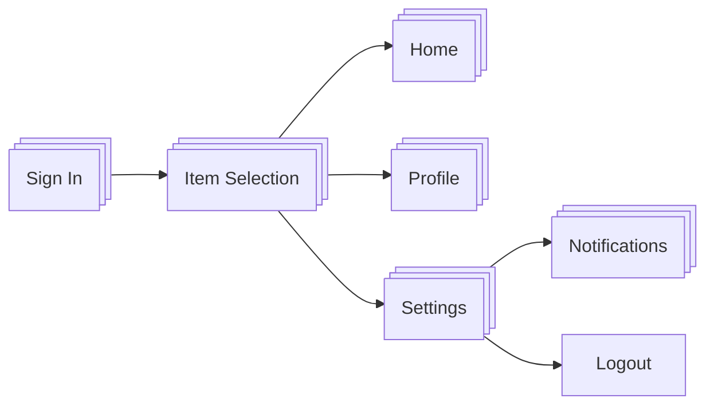

# 🧪 TestRail Flows

> ℹ️ This document outlines the structure and rules for organizing, creating, and managing test cases in TestRail for the `App` project. All examples, names, and links have been anonymized for demonstration purposes.

---

## 🧪 TestRail Flows — Table of Contents

1. [✅ General Rules](#-1-general-rules)
2. [📍 Milestones](#-2-milestones)
3. [🧾 Test Case Creation Rules](#-3-test-case-creation-rules)
   - [3.1 Sprint Feature Testing](#-31-sprint-feature-testing)
   - [3.2 Smoke Testing](#-32-smoke-testing)
   - [3.3 Regression Testing](#-33-regression-testing)
   - [3.4 Automated Testing](#-34-automated-testing)
4. [🧪 Test Cases Execution](#-4-test-cases-execution)
   - [🗂️ Test Plan](#-41-test-plan)
   - [🧾 Test Run](#-42-test-run)
   - [▶️ Test Executions](#-43-test-executions)
5. [📊 Reports](#5-reports)
   - [5.1 How to Trigger a Report](#51-how-to-trigger-a-report)
   - [5.2 Adding Test Reports to the Sprint Review](#52-adding-test-reports-to-the-sprint-review)
     - [5.2.1 Metrics from Test Management Reports](#521-metrics-from-test-management-reports)
     - [5.2.2 Test Execution Report](#522-test-execution-report)

---

## ✅ 1. General Rules

- Folder structure should reflect functionality:
  - Example: `Sign In` > `Item Selection` > `Home` > …

- Each test case must include:
  - A clear and descriptive **title**
  - Assigned **Priority** (used for Smoke/Regression/AQA selection)
  - **References**:
    - EPIC ID
    - User Story ID
    - Acceptance Criteria ID in format `<UserStory_ID>-AC<AcceptanceCriteria_ID>`
    - *Note: Acceptance Criteria will be used for reporting and not be clickable inside TestRail.*
  - **Preconditions** *(if applicable)*
  - **Acceptance Criteria** *(if applicable)*
  - Step-by-step description with **Expected Results**
  - Associated **Milestone**
  - Optional: Mock-up or link to UX/UI asset

---

## 📍 2. Milestones

- Separate **Milestones** are created per development sprint:
  - e.g. `Sprint 1`, `Sprint 2`, ...
- Dedicated automation milestones:
  - e.g. `Smoke Automation`, `Regression Automation`
- Milestones are **closed once the development sprint ends**
- Failed test cases from previous milestones:
  - Must be logged as **Bug** in Jira
  - Include a link to the failed TestRail test case from the new sprint milestone

---

## 🧾 3. Test Case Creation Rules

### 3.1 Sprint Feature Testing

- Applies General Rules (see section 1)
- Location in TestRail:
  - Suite: `Feature Testing`
  - Project: `Mobile Platform Alpha`
- Test cases are created by QA and shared with team for review if needed

### 3.2 Smoke Testing

- Applies General Rules
- Location in TestRail:
  - Suite: `Smoke Testing`
  - Project: `Mobile Platform Alpha`

### 3.3 Regression Testing

- Applies General Rules
- Location in TestRail:
  - Suite: `Regression Testing`
  - Project: `Mobile Platform Alpha`

### 3.4 Automated Testing

- Applies General Rules
- Automation QA engineer reviews manual test cases
- Test cases marked for automation using the **“Automation Status”** field

---

## 🧪 4. Test Cases Execution

---

### 🗂️ 4.1 Test Plan

- A separate **Sprint Test Plan** is created for each development sprint  
  - e.g. `[Sprint 1] Manual Test Execution` for development sprint #1
- Each Test Plan is linked to the appropriate **Milestone**  
  - e.g. `[Sprint 1] Manual Test Execution` ➝ `Sprint 1` milestone
- Dedicated Test Plans are also created for:
  - **Smoke Testing** (`Smoke testing`)
  - **Regression Testing** (`Regression testing`)
  - **Automation** (`Smoke automation`, `Regression automation`)
- Test Plans are **closed** once the sprint is finished
- ❗ Failed test cases from past sprints:
  - Must be logged as **Bug in Jira**
  - Include a **link** to the failed test case in the new development sprint

---

### 🧾 4.2 Test Run

- Each **User Story** gets a dedicated **Test Run** within the Sprint Test Plan
  - Test Run = Test Suite
- ✅ Test Run Naming Format:
  - `<User Story ID>: <User Story Title>`
  - Example: `MTP-1: Sign In`
- Each Test Run must specify:
  - Correct **Configurations**: Device Type, OS Version, etc.
  - Relevant **test cases** selected
  - Proper **assignee** for each Test Run or Configuration
- Additional dedicated Test Runs:
  - Smoke Testing: `Smoke testing`
  - Regression Testing: `Regression testing`
  - Automation Testing: `Smoke automation`, `Regression automation`
- Test Runs are **closed** after sprint ends
- ❗ Failed test cases from past runs:
  - Log as **Bug in Jira**. 
  > Please see details on [Jira Workflows / 3.2 Not in the Scope of Sprint Feature Testing](/Test_Plans/Jira_workflows.md#32-not-in-the-scope-of-sprint-feature-testing) 
  - Link to the failed test case under new sprint milestone

---

### ▶️ 4.3 Test Executions

- Tests are executed on the **environment specified** under “Configurations” in the Test Plan
- Tester actions during execution:
  - Use **Start / Pause / Stop Progress** controls
  - **Assign** the test case to self
  - Mark **Execution Status** and enter result for each test case
  - Add **Build/Env info** in the “Comments” field
  - If available, attach **evidence** of execution (Screenshot / Screencast) to “Actual Result”
  - Specify **Bug ID** (only ID, not link) in the “Defects” field
- ✅ A test case may be marked **PASSED**, even if some steps are **FAILED**, but only if:
  - Failed steps are **trivial**
  - Do **not impact core functionality** or business criteria
- 🔁 Re-executions:
  - Use **existing test cases** within the same Test Run
  - No need for new Test Run/Execution if sprint is finished and cases still fail

---

## 5. Reports

The test management system provides the ability to generate reports that aggregate various types of data to give deep insights into your testing process. These reports are accessible via the **Reports** option in the top navigation bar.

Currently, the *mobile project* includes a few reports that are generated automatically but can also be triggered manually if needed.

---

### 5.1. How to Trigger a Report

1. Log in to the test management system (e.g., `https://yourdomain.testrail.net`)
2. Navigate to the *mobile project*
3. In the top navigation bar, click on **Reports**

4. The **Reports** page provides:
   - Shared/public reports (visible only to authorized users) listed at the top, with the newest first
   - At the bottom: scheduled report templates for each sprint

   These include:
   - A link to the **Reports** page of the project
   - A **Schedule** section with prepared reports for sprints
   - The scheduled reports list
   - Details of the schedule, such as execution timing and deadline
   - Scheduled report actions:
     1. Edit the scheduled report
     2. Create or schedule a similar report
     3. Delete the scheduled report

5. Click **Create or schedule a similar report** to trigger/generate a new report based on the scheduled one:
   - A new report generation will begin
   - The new report will appear at the top of the **Reports** page

6. Wait until the report generation is complete

---

### 5.2. Adding Test Reports to the Sprint Review

At the end of each sprint, QA activity reports should be added to the sprint review page located under the following parent page:

`https://yourdomain.atlassian.net/wiki/...`

---

#### 5.2.1. Metrics from Test Management Reports

The following metrics should be generated and added to the corresponding sprint review page:

- RTM – Test Coverage by Acceptance Criteria
- RTM – Test Coverage by Story

Steps to include them:

- Generate the reports (as described above)
- Open the **RTM – Test Coverage by Story** report
  - Take a screenshot of the top section with charts and descriptions
  - Insert the screenshot into the **Story Coverage** section of the **QA Reports** part of the sprint review page
- Open the **RTM – Test Coverage by Acceptance Criteria** report
  - Take a screenshot of the top section with charts and descriptions
  - Insert the screenshot into the **Coverage by Acceptance Criteria** section of the **QA Reports** part of the sprint review page

---

#### 5.2.2. Test Execution Report

This report should also be added to the **Sprint Review** page.

Steps to add it:

- Log in to the test management system
- Navigate to the **Milestones** section of the project
- Open the milestone named after the sprint, e.g., `Sprint 6`
- Take a screenshot of the page containing:
  - Charts and overview at the top
  - Test runs information

- Insert the screenshot into the **Test Execution Report** section of the **QA Reports** part of the sprint review page

---
